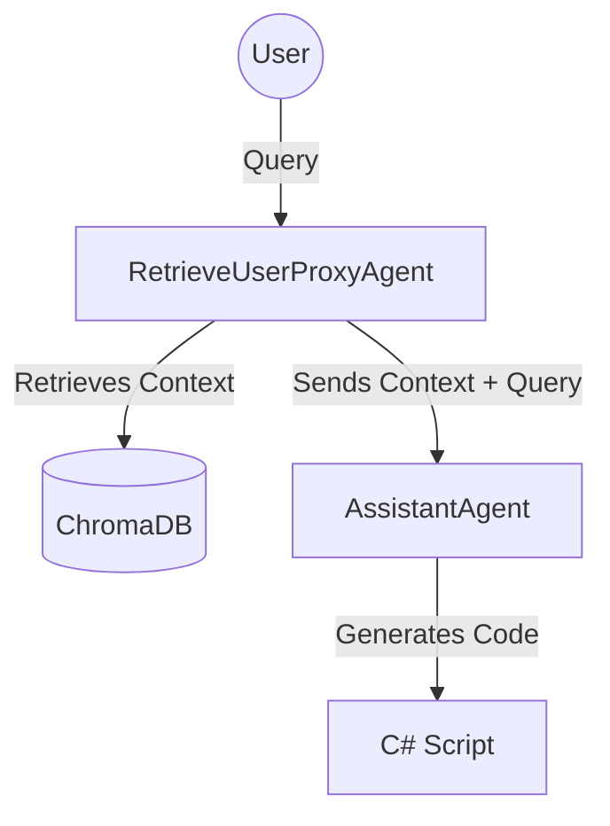

# EPLAN AutoGen Assistant 🚀

**An AI-powered Coding Assistant for EPLAN Electric P8, built with Microsoft AutoGen.**

This tool uses a **Native RAG (Retrieval-Augmented Generation)** architecture to find relevant EPLAN API documentation and valid script examples, then generates precise C# code for your automation needs.

> ⚠️ **Status**: MVP (Minimum Viable Product) - Standby Development, Eplan will release an AI assistant for P8 in the future.

---

##  Key Features

*   **🤖 EPLAN Engineer Agent**: An expert AI agent that understands EPLAN's Object Model.
*   **📚 Native RAG Engine**: Uses **ChromaDB** to index and search over **17,000+** knowledge files (API Docs & Script Examples).
*   **🐍 Pure Python**: Built purely on `pyautogen`, removing complex custom logic in favor of industry standards.
*   **🔒 Corporate Friendly**: Designed to run offline (after initial model download) and works alongside corporate firewalls.

---

## Quick Start

### Prerequisites
*   **Python 3.10+** (installed and added to PATH)
*   **Internet Access** (Only for the first run to download models from HuggingFace)
*   **Gemini API Key** (Set in `.env`)

### Installation

1.  **Clone the repository**
2.  **Configure API Key**
    Create a `.env` file in the root directory:
    ```env
    GEMINI_API_KEY=AIxxxx...
    ```
3.  **Run the Assistant**
    Just double-click:
    ```bash
    run_agent.bat
    ```

> **Note**: The first run will take a few minutes. The system needs to download the embedding models and index the 17,000 document chunks into the local vector database. **Be patient!**

---

##  Architecture

The system uses a simple 2-Agent "Tool Use" pattern:



1.  **RetrieveUserProxyAgent ("Admin")**:
    *   Acts as the interface for the user.
    *   Automatically searches the `src/ai/Knowledge/` folder for relevant info when you ask a question.
    *   Injects that info into the conversation context.

2.  **AssistantAgent ("EplanEngineer")**:
    *   Receives the user query + the retrieved context.
    *   Uses Gemini 2.5 Flash to generate compilation-ready C# code based *strictly* on the provided examples.

---

## 📁 Project Structure

```
LazyScriptingEplan/
├── src/
│   ├── ai/
│   │   └── Knowledge/          # The Brain (PDFs, JSONs, Markdowns)
│   └── app.py                  # Main AutoGen Application logic
│
├── .venv/                      # Isolated Python Environment (Auto-generated)
├── run_agent.bat               # Smart Launcher (Handles venv & deps)
├── requirements.txt            # Dependencies (pyautogen, chromadb, etc.)
└── README.md                   # This file
```

---

## 🔧 Troubleshooting

### "ModuleNotFoundError"
Always use `run_agent.bat`. Do not try to run `python app.py` directly unless you have manually activated the `.venv`. The batch script handles isolation automatically.

### SSL / Certificate Errors
If you are behind a strict corporate proxy ("Zscaler", "Netskope", etc.), the initial model download might fail.
*   **Solution**: Run the first setup on a personal network (Home WiFi/Hotspot). Once the models are cached in `.cache/`, you can work offline in the office.

---

## 🤝 Credits

*   **Microsoft AutoGen**: For the agent orchestration framework.
*   **ChromaDB**: For the vector database engine.
*   **Google Gemini**: For the LLM intelligence.
*   **Suplanus**: For the base EPLAN script examples.
