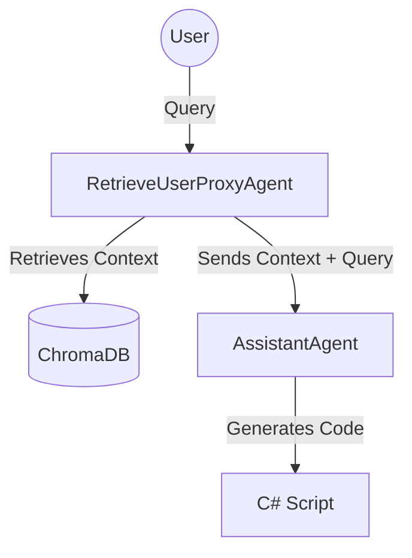

# EPLAN AutoGen Assistant 🚀

**An AI-powered Coding Assistant for EPLAN Electric P8, built with Microsoft AutoGen.**

<<<<<<< HEAD
This tool uses a **Native RAG (Retrieval-Augmented Generation)** architecture to find relevant EPLAN API documentation and valid script examples, then generates precise C# code for your automation needs.

> ⚠️ **Status**: MVP (Minimum Viable Product) - Standby Development, Eplan will release an AI assistant for P8 in the future.
=======
> ⚠️ **Status**: stand-by
>>>>>>> 93a6d7944322254cf68ec6eba163017e68b1da85

---

##  Key Features

<<<<<<< HEAD
*   **🤖 EPLAN Engineer Agent**: An expert AI agent that understands EPLAN's Object Model.
*   **📚 Native RAG Engine**: Uses **ChromaDB** to index and search over **17,000+** knowledge files (API Docs & Script Examples).
*   **🐍 Pure Python**: Built purely on `pyautogen`, removing complex custom logic in favor of industry standards.
*   **🔒 Corporate Friendly**: Designed to run offline (after initial model download) and works alongside corporate firewalls.
=======
### 🤖 Multi-Agent Architecture
- **Natural Language Interface** - Describe what you want, get working code
- **Intelligent Orchestration** - Coordinator routes tasks to specialized agents
- **Code Generation** - Transform requirements into EPLAN C# scripts
- **Validation & Security** - Automatic syntax and security checks
- **Direct Execution** - Run scripts via EPLAN Remoting

### 🔍 RAG System
- **Plug & Play** - Works immediately without setup
- **Hybrid Search** - BM25 keyword + optional vector search + Cross-Encoder re-ranking
- **Smart Chunking** - Handles long documents with overlap
- **Offline-First** - No internet required after initial clone
- **Corporate-Friendly** - Works behind firewalls and VPNs
- **606 API Docs** + **70 Script Examples** indexed and searchable
>>>>>>> 93a6d7944322254cf68ec6eba163017e68b1da85

---

## Quick Start

### Prerequisites
*   **Python 3.10+** (installed and added to PATH)
*   **Internet Access** (Only for the first run to download models from HuggingFace)
*   **Gemini API Key** (Set in `.env`)

### Installation

1.  **Clone the repository**
2.  **Configure API Key**
    Create a `.env` file in the root directory:
    ```env
    GEMINI_API_KEY=AIxxxx...
    ```
3.  **Run the Assistant**
    Just double-click:
    ```bash
    run_agent.bat
    ```

> **Note**: The first run will take a few minutes. The system needs to download the embedding models and index the 17,000 document chunks into the local vector database. **Be patient!**

---

##  Architecture

The system uses a simple 2-Agent "Tool Use" pattern:



1.  **RetrieveUserProxyAgent ("Admin")**:
    *   Acts as the interface for the user.
    *   Automatically searches the `src/ai/Knowledge/` folder for relevant info when you ask a question.
    *   Injects that info into the conversation context.

<<<<<<< HEAD
2.  **AssistantAgent ("EplanEngineer")**:
    *   Receives the user query + the retrieved context.
    *   Uses Gemini 2.5 Flash to generate compilation-ready C# code based *strictly* on the provided examples.
=======
| Agent | Purpose | Technology |
|-------|---------|-----------|
| **Coordinator** | Task routing and orchestration | Google ADK |
| **Knowledge Agent** | API documentation search | RAG (606 docs) |
| **Examples Agent** | Script pattern matching | RAG (70 examples) |
| **CodeCraft Agent** | C# code generation | LLM + Templates |
| **Validation Agent** | Security & syntax checks | AST parsing |
| **Execution Agent** | EPLAN integration | .NET Remoting |

---

## 📊 RAG System Details

### Search Modes

#### 1. BM25-Only Mode (Default) 
- Works immediately, zero setup
- Keyword-based search
- 100% offline
- Fast: 5ms per query

#### 2. Hybrid Mode (Optional) 
- BM25 + Vector embeddings (FAISS)
- Semantic understanding
- 10-15% better results
- Requires one-time model download

#### 3. Hybrid + Re-ranking Mode (Advanced) 
- Hybrid search + Cross-Encoder re-ranking
- Maximum precision for complex queries
- 15-25% better results than hybrid alone
- Two-stage: 20 candidates → top 5 results

### Enable Advanced Modes

```bash
# Optional: Download embedding model for hybrid mode
python setup_embedding_model.py
```

See [RAG_SETUP_GUIDE.md](RAG_SETUP_GUIDE.md) for detailed setup and [PHASE4_RERANKING.md](PHASE4_RERANKING.md) for re-ranking implementation details.
>>>>>>> 93a6d7944322254cf68ec6eba163017e68b1da85

---

## 📁 Project Structure

```
LazyScriptingEplan/
├── src/
│   ├── ai/
│   │   └── Knowledge/          # The Brain (PDFs, JSONs, Markdowns)
│   └── app.py                  # Main AutoGen Application logic
│
├── .venv/                      # Isolated Python Environment (Auto-generated)
├── run_agent.bat               # Smart Launcher (Handles venv & deps)
├── requirements.txt            # Dependencies (pyautogen, chromadb, etc.)
└── README.md                   # This file
```

---

## 🔧 Troubleshooting

### "ModuleNotFoundError"
Always use `run_agent.bat`. Do not try to run `python app.py` directly unless you have manually activated the `.venv`. The batch script handles isolation automatically.

### SSL / Certificate Errors
If you are behind a strict corporate proxy ("Zscaler", "Netskope", etc.), the initial model download might fail.
*   **Solution**: Run the first setup on a personal network (Home WiFi/Hotspot). Once the models are cached in `.cache/`, you can work offline in the office.

---

## 🤝 Credits

<<<<<<< HEAD
*   **Microsoft AutoGen**: For the agent orchestration framework.
*   **ChromaDB**: For the vector database engine.
*   **Google Gemini**: For the LLM intelligence.
*   **Suplanus**: For the base EPLAN script examples.
=======
### RAG Metrics
| Metric | Value |
|--------|-------|
| Documents Indexed | 676 (606 docs + 70 examples) |
| Chunks Created | ~800-1000 |
| Search Speed | 5-250ms (mode dependent) |
| Index Build | 30-60s (first run only) |
| Memory Usage | 50-280MB (mode dependent) |

### Search Quality
| Mode | Improvement | Speed |
|------|-------------|-------|
| BM25-only | Baseline | 5ms |
| Hybrid | +10-15% | 5-50ms |
| Hybrid + Re-ranking | +25-40% | 55-250ms |

---

## 🧪 Testing

```bash
# Test RAG system (BM25, Hybrid, Re-ranking)
python test_rag.py

# Test specific agents (coming soon)
pytest tests/
```

---

## 🤝 Contributing

The system is designed to be extensible:

### Add New Agents
```python
# Create new agent in src/sub_agents/your_agent/
from google import genai

your_agent = genai.Agent(
    model="gemini-2.0-flash-exp",
    tools=[your_tools],
    system_instruction="Your agent's role"
)
```

### Extend RAG
```python
# Add new document sources
class CustomRAG(OptimizedRAG):
    def _build_from_files(self):
        # Your indexing logic
        pass
```

### Custom Tools
```python
# Add tools to agents
@tool
def your_custom_tool(param: str) -> str:
    """Tool description"""
    return result
```

---

## 🙏 Credits

- **EPLAN Examples**: [Suplanus](https://github.com/Suplanus)
- **Framework**: Google Agent Development Kit (ADK)
- **RAG Components**:
  - FAISS - Facebook AI Similarity Search
  - BM25 - Best Match 25 algorithm
  - sentence-transformers - Embedding models
  - Cross-Encoder - ms-marco-MiniLM-L-6-v2

---


---

## 📚 Documentation

- [RAG Setup Guide](RAG_SETUP_GUIDE.md) - Detailed RAG configuration
- [Phase 4 Re-ranking](PHASE4_RERANKING.md) - Technical implementation details

---


>>>>>>> 93a6d7944322254cf68ec6eba163017e68b1da85
