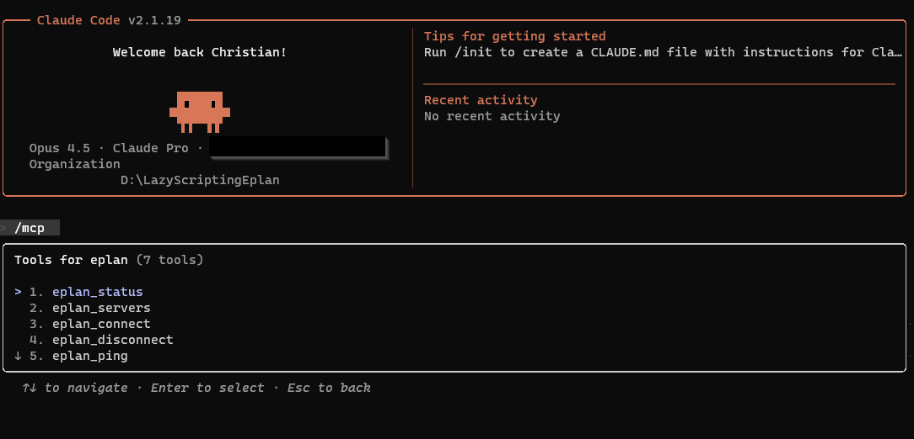

# EPLAN Automation Tools

This repository contains tools for automating EPLAN Electric P8 using AI assistants.
Currently is 100% functional

## MCP Server (Recommended)

The **MCP Server** (`mcp_server/`) allows any AI to control EPLAN directly through the Model Context Protocol.

### What is MCP?

**MCP (Model Context Protocol)** is an open standard that allows AI assistants like Claude to interact with external tools and services. Instead of just generating code, Claude can actually *execute* actions in EPLAN in real-time.

With MCP, you can:
- Connect to a running EPLAN instance
- Execute EPLAN actions directly from Claude
- Get real-time feedback on operations
- Automate complex workflows through natural conversation

### Quick Start

1. Install dependencies:
   ```bash
   pip install pythonnet mcp
   ```

2. Configure Claude CLI (edit `~/.claude/settings.json`):
   ```json
   {
     "mcpServers": {
       "eplan": {
         "command": "python",
         "args": ["YOUR_PATH\\LazyScriptingEplan\\mcp_server\\server.py"]
       }
     }
   }
   ```

3. Restart Claude CLI and start using EPLAN tools!

See [mcp_server/README.md](mcp_server/README.md) for detailed installation instructions.



---

## Adding New EPLAN Actions

The MCP server is designed to be easily extensible. Here's how to add new EPLAN actions:


### Step 1: Add the Function to `eplan_actions.py`

```python
def example_project(project_path: str) -> dict:
    """
    Open an EPLAN project.
    Action: example
    """
    manager = get_manager(TARGET_VERSION)

    if not manager.connected:
        return {"success": False, "message": "Not connected to EPLAN"}

    # Note: Use forward slashes or escape backslashes in the path
    return manager.execute_action(f'example /param1:"{project_path}"')
```

### Step 3: Register the Tool in `server.py`

```python
from eplan_actions import close_project, example_project  # Add your import

@mcp.tool()
def example_project(project_path: str) -> str:
    """Open an EPLAN project by path."""
    return json.dumps(example_project(project_path), indent=2)
```

### Step 4: Restart Claude CLI

The new tool will be available after restarting Claude CLI.


### Tips for Adding Actions

1. **Test in EPLAN first** - Use EPLAN's scripting to verify the action works
2. **Check parameters** - Each action has specific parameters; refer to the API documentation
3. **Handle paths carefully** - Windows paths need escaping or use forward slashes
4. **Add meaningful docstrings** - Claude uses the docstring to understand when to use the tool

---

## OG Project Structure

```
LazyScriptingEplan/
├── mcp_server/                 # MCP Server for Claude integration
│   ├── server.py               # Main MCP server with tool definitions
│   ├── eplan_connection.py     # EPLAN connection management
│   ├── eplan_actions.py        # EPLAN action implementations
│   └── README.md               # MCP installation guide
│
└── README.md                   # This file
```

---

## Resources

- [EPLAN API Documentation](https://www.eplan.help/)
- [MCP Protocol Specification](https://modelcontextprotocol.io/)
- [Claude Code Documentation](https://docs.anthropic.com/claude-code)
