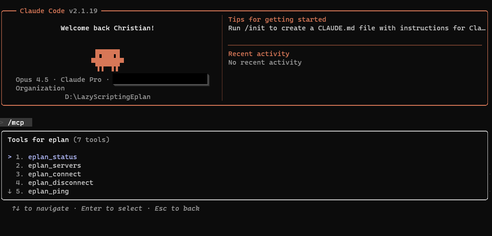
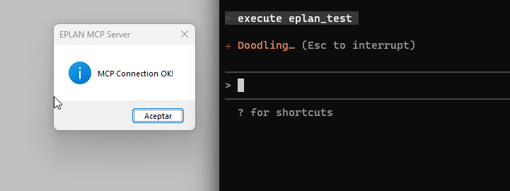

# EPLAN AI Automation Toolkit

A collection of AI-assisted automation tools for **EPLAN Electric P8** and **EPLAN EEC Pro 2026**, built around the Model Context Protocol (MCP).

The repo contains four independent sub-projects: a local MCP server that drives EPLAN P8 directly, a documentation scraper / local RAG indexer for EEC Pro, and two remote MCP servers hosted on Cloudflare Workers that expose the indexed documentation via semantic search.

## Repository Layout

```
.
├── eplan-p8-mcp-server/          # LOCAL: MCP server that controls EPLAN P8 (and embedded RAG engine)
├── eplan-eecpro-rag-builder/     # LOCAL: scraper + LlamaIndex/ChromaDB indexer for EEC Pro docs
├── cloudflare-rag-eplan-p8/      # REMOTE: Cloudflare Worker that serves the P8 docs RAG over MCP
└── cloudflare-rag-eecpro/        # REMOTE: Cloudflare Worker that serves the EEC Pro docs RAG over MCP
```

| Folder | Type | Purpose | EPLAN product |
|--------|------|---------|---------------|
| `eplan-p8-mcp-server/` | Local Python MCP | Drive a running EPLAN instance from Claude (open/close projects, exports, scripts, etc.) | EPLAN Electric P8 |
| `eplan-eecpro-rag-builder/` | Local Python pipeline | Scrape official docs and build a local ChromaDB vector index | EPLAN EEC Pro 2026 |
| `cloudflare-rag-eplan-p8/` | Remote Cloudflare Worker | Serve the P8 doc index as a remote MCP + REST API | EPLAN Electric P8 |
| `cloudflare-rag-eecpro/` | Remote Cloudflare Worker | Serve the EEC Pro doc index as a remote MCP + REST API | EPLAN EEC Pro 2026 |

Each sub-project has its own README with installation and usage details.

## What is MCP?

**MCP (Model Context Protocol)** is an open standard that lets AI assistants like Claude interact with external tools and services. Instead of just generating code, Claude can actually *execute* actions in EPLAN in real-time and consult documentation through semantic search.

## Quick Start

### Local EPLAN automation (P8)

The local MCP server lets Claude drive a running EPLAN instance.

```bash
pip install pythonnet mcp
claude mcp add eplan -- python YOURPATH/eplan-p8-mcp-server/mcp_server/server.py
claude mcp list   # should list "eplan"
```

Then start EPLAN, open Claude Code, and say `connect to eplan`. See [`eplan-p8-mcp-server/mcp_server/README.md`](eplan-p8-mcp-server/mcp_server/README.md) for the full guide.



### Remote documentation RAGs (P8 and EEC Pro)

These are already deployed and ready to use — no local data required:

```bash
# EPLAN Electric P8 documentation
claude mcp add eplan-rag -- cmd /c npx mcp-remote https://rag2026.covaga.xyz/mcp

# EPLAN EEC Pro 2026 documentation
claude mcp add eecpro-rag -- cmd /c npx mcp-remote https://rageecpro.covaga.xyz/mcp
```

See [`cloudflare-rag-eplan-p8/README.md`](cloudflare-rag-eplan-p8/README.md) and [`cloudflare-rag-eecpro/README.md`](cloudflare-rag-eecpro/README.md) for the tools, REST endpoints, and architecture.

### Building the local EEC Pro RAG (optional)

If you want to (re)build the EEC Pro vector index locally — for instance to push it to your own Cloudflare account — see [`eplan-eecpro-rag-builder/README.md`](eplan-eecpro-rag-builder/README.md).

## Adding New EPLAN Actions

The local MCP server is designed to be easily extensible. To add a new EPLAN action:

### 1. Implement the action

In `eplan-p8-mcp-server/mcp_server/actions/<your_module>.py`:

```python
def open_project(project_path: str) -> dict:
    """Open an EPLAN project."""
    manager = get_manager(TARGET_VERSION)
    if not manager.connected:
        return {"success": False, "message": "Not connected to EPLAN"}
    # Use forward slashes or escape backslashes in the path
    return manager.execute_action(f'XPrjActionProjectOpen /Path:"{project_path}"')
```

### 2. Register the tool

In `eplan-p8-mcp-server/mcp_server/server.py`:

```python
from actions.project import open_project

@mcp.tool()
def eplan_open_project(project_path: str) -> str:
    """Open an EPLAN project by path."""
    return json.dumps(open_project(project_path), indent=2)
```

### 3. Restart Claude CLI

The new tool will be available after restarting Claude.



### Tips

1. **Test in EPLAN first** — use EPLAN's scripting console to verify the action works.
2. **Check parameters** — every action has specific parameters; refer to the EPLAN API docs.
3. **Handle paths carefully** — Windows paths need escaping (`\\`) or forward slashes (`/`).
4. **Write meaningful docstrings** — Claude uses the docstring to decide when to call the tool.

## Changing EPLAN Version

The target EPLAN version is configured in **3 files**. Update all of them when switching versions (e.g. `"2025"` → `"2026"`):

| File | What to change |
|------|----------------|
| `eplan-p8-mcp-server/mcp_server/server.py` | `TARGET_VERSION = "2025"` |
| `eplan-p8-mcp-server/mcp_server/actions/_base.py` | `TARGET_VERSION = "2025"` |
| `eplan-p8-mcp-server/mcp_server/eplan_connection.py` | Default parameter in `__init__` and `get_manager` (`target_version: str = "2025"`) |

## Resources

- [EPLAN API Documentation](https://www.eplan.help/)
- [MCP Protocol Specification](https://modelcontextprotocol.io/)
- [Claude Code Documentation](https://docs.anthropic.com/claude-code)
