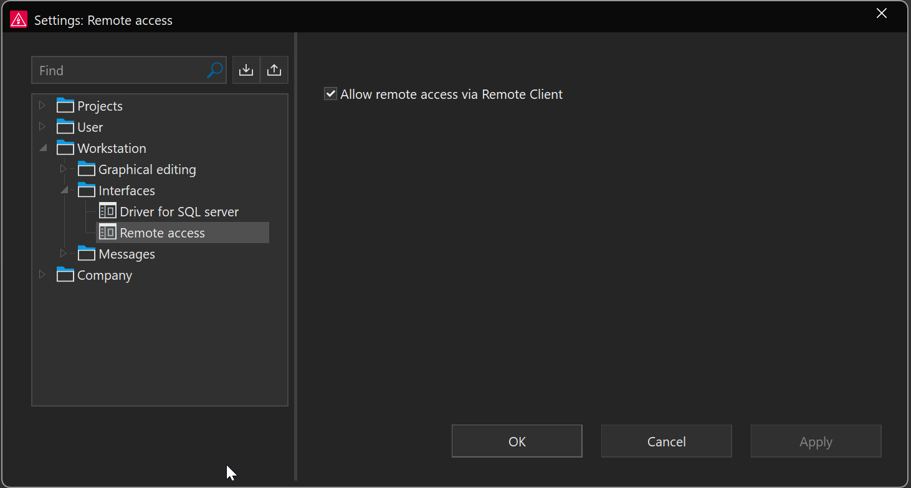

# EPLAN AI Automation Toolkit

A collection of AI-assisted automation tools for **EPLAN Electric P8** and **EPLAN EEC Pro 2026**, built around the Model Context Protocol (MCP).

The repo contains three independent sub-projects: a local MCP server that drives EPLAN P8 directly, and two remote MCP servers hosted on Cloudflare Workers that expose the indexed documentation via semantic search.

> Working with an LLM here? Read [`llm.md`](llm.md) — it explains, in LLM-facing
> terms, everything the toolkit can do and configure.

## Repository Layout

```
.
├── eplan-p8-mcp-server/          # LOCAL: MCP server that controls EPLAN P8
├── cloudflare-rag-eplan-p8/      # REMOTE: Cloudflare Worker that serves the P8 docs RAG over MCP
└── cloudflare-rag-eecpro/        # REMOTE: Cloudflare Worker that serves the EEC Pro docs RAG over MCP
```

| Folder | Type | Purpose | EPLAN product |
|--------|------|---------|---------------|
| `eplan-p8-mcp-server/` | Local Python MCP | Drive a running EPLAN instance from Claude (open/close projects, exports, reports, scripts, etc.) | EPLAN Electric P8 |
| `cloudflare-rag-eplan-p8/` | Remote Cloudflare Worker | Serve the P8 doc index as a remote MCP + REST API | EPLAN Electric P8 |
| `cloudflare-rag-eecpro/` | Remote Cloudflare Worker | Serve the EEC Pro doc index as a remote MCP + REST API | EPLAN EEC Pro 2026 |

Each sub-project has its own README with installation and usage details.

## What is MCP?

**MCP (Model Context Protocol)** is an open standard that lets AI assistants like Claude interact with external tools and services. Instead of just generating code, Claude can actually *execute* actions in EPLAN in real time and consult documentation through semantic search.

## Quick Start

### Local EPLAN automation (P8)

The local MCP server lets Claude drive a running EPLAN instance. It exposes
**156 tools**: 7 connection/utility tools plus **149 EPLAN actions**
(`eplan_*`), every one executed silently inside a C# script under QuietMode —
no EPLAN dialog can block unattended runs.

The EPLAN version is **auto-detected**: the server scans
`C:\Program Files\EPLAN\Platform` and targets the newest installed version.
No configuration needed.

```bash
pip install pythonnet mcp
claude mcp add eplan -- python YOURPATH/eplan-p8-mcp-server/mcp_server/server.py
claude mcp list   # should list "eplan"
```

Then start EPLAN, open Claude Code, and say `connect to eplan`. See [`eplan-p8-mcp-server/mcp_server/README.md`](eplan-p8-mcp-server/mcp_server/README.md) for the full guide.


#### Precondition of use

To use remoting, please proceed as follows:

To start Eplan remoting, you must first activate the **Allow remote access via Remote Client** setting. You can do this via GUI in the settings dialog (**File > Settings... > Workstation > Interfaces > Remote access**).



### Remote documentation RAGs (P8 and EEC Pro)

These are already deployed and ready to use — no local data required:

```bash
# EPLAN Electric P8 documentation
claude mcp add eplan-rag -- cmd /c npx mcp-remote https://rag2026.covaga.xyz/mcp

# EPLAN EEC Pro 2026 documentation
claude mcp add eecpro-rag -- cmd /c npx mcp-remote https://rageecpro.covaga.xyz/mcp
```

They also expose a plain REST API (handy for verifying EPLAN action names and
parameters while developing):

```bash
curl -X POST https://rag2026.covaga.xyz/search -H "Content-Type: application/json" \
     -d "{\"query\": \"export project pdf\", \"topK\": 3}"
```

See [`cloudflare-rag-eplan-p8/README.md`](cloudflare-rag-eplan-p8/README.md) and [`cloudflare-rag-eecpro/README.md`](cloudflare-rag-eecpro/README.md) for the tools, REST endpoints, and architecture.

## Adding New EPLAN Actions

The local MCP server registers tools **dynamically** from each actions package's
`__all__` list, so adding an action is just two steps (no per-tool boilerplate).

### 1. Implement the action

In `eplan-p8-mcp-server/mcp_server/api/actions/<your_module>.py`:

```python
def open_project(project_path: str, open_mode: str = None) -> dict:
    """Open a project in EPLAN.

    Args:
        project_path: Full path to the .elk project file.
        open_mode: "Standard", "ReadOnly", or "Exclusive" (optional).
    """
    manager, error = _get_connected_manager()
    if error:
        return error
    action = _build_action("ProjectOpen", Project=project_path, OpenMode=open_mode)
    return manager.execute_action(action)
```

### 2. Export it

Add the function to the imports **and** to `__all__` in
`eplan-p8-mcp-server/mcp_server/api/actions/__init__.py`. It is then
auto-registered as `eplan_open_project`.

### 3. Restart the MCP server

The new tool becomes available after restarting Claude / the server.

### 4. Validate against the official docs (optional)

`eplan-p8-mcp-server/tools/validate_actions.py` cross-checks every action name
and parameter declared in the wrappers against the official EPLAN docs RAG and
writes a markdown report:

```bash
python eplan-p8-mcp-server/tools/validate_actions.py
```


### Tips

1. **Verify against the docs** — use the remote P8 RAG (`https://rag2026.covaga.xyz`) to confirm the exact EPLAN action name and parameters.
2. **Write meaningful docstrings + type hints** — they become the tool description and input schema the LLM sees and relies on.
3. **Handle paths carefully** — Windows paths need escaping (`\\`) or forward slashes (`/`).

## EPLAN Version Selection (automatic)

There is **nothing to configure**. On startup the server scans
`C:\Program Files\EPLAN\Platform` for installed versions and:

- **Auto mode (default):** `eplan_connect` targets the **newest installed
  version** and picks the right .NET runtime automatically (coreclr for
  EPLAN 2027+, .NET Framework for 2026 and older).
- **Explicit mode (LLM's choice):** the LLM can call `eplan_versions` to list
  what is installed and then connect to a specific one with
  `eplan_connect(version="2026")` — e.g. "connect to eplan 2026".

Notes:
- EPLAN installed somewhere non-standard? Set the `EPLAN_PLATFORM_ROOT`
  environment variable to its `Platform` folder.
- Once one version's DLLs are loaded into the process, switching to another
  version requires restarting the MCP server (a .NET runtime cannot be swapped
  at runtime).
- `eplan_connect` also accepts a `host` (and `"host:port"`) to reach an EPLAN
  instance on another machine; port auto-detection only works on localhost.

## Resources

- [EPLAN API Documentation](https://www.eplan.help/)
- [MCP Protocol Specification](https://modelcontextprotocol.io/)
- [Claude Code Documentation](https://docs.anthropic.com/claude-code)
